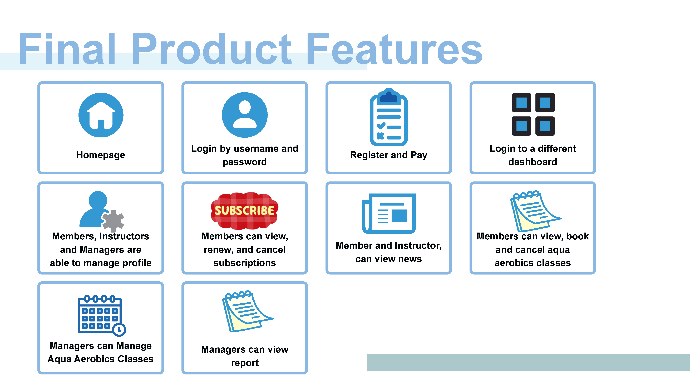
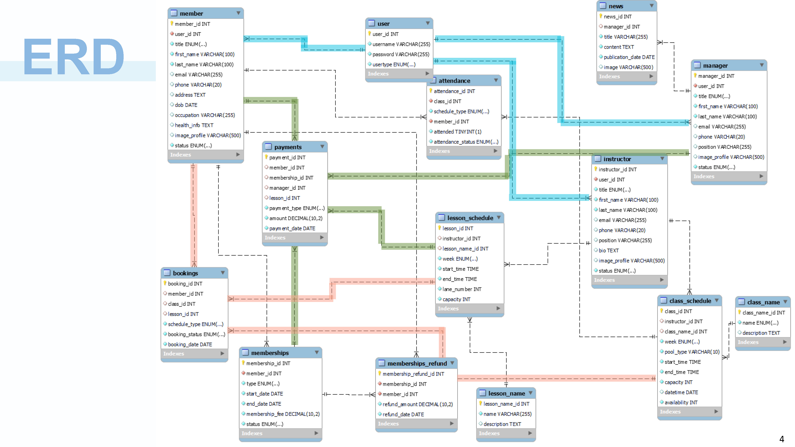

# COMP639S1_Group_ZZ
- COMP639 Assignment 2 - Group Project 1
- Student Name:Alex Zhao, Yingyue(Rita) Chen
- Student ID: 1156956, 1126418

## Project Description
- Client: Countryside Community Swimming Club
- Project Overview: Countryside Community Swimming Club provides activities of – Aqua aerobic swimming, and one on one lessons. Currently, they are facing issues with manual management systems.
- Vison and Misson of this project: 
    - Developing a Web Application.
    - Digital system of managing the Countryside Community Swimming Club.

## Project Delivery
- Since we are a small team with only two members, according to our team's ability, we had discussed with the product owner, and with agreement with the product owner that we only focus on high-priority tasks first. Additional features are considered only if time permits.
- Our Final Feature to be delivery:

- Our Porject Key and Highlighted point: 
    1. Dynamic schedule.
    2. A visually appealing UI.
    3. Easy to use.

## Web Application Structure
1. The Web structure has been refactoring by role or function. 
- `/COMP639S1_GROUP_ZZ`: This is the root directory of the project.
  - `/app`: This directory contains the Flask application and its modules.
    - `__init__.py`: This file initializes the Flask application and brings together all the components.
    - `connect.py`: This file contains the configuration for the database connection.
    - `database.py`: This file handles the database connection.
    - `member_views.py`: This file contains the routes and views for members. It includes functionalities like booking, viewing, and cancelling aerobics timetable, viewing, cancelling, and renewing subscription, and viewing subscription payment history.
    - `instructor_views.py`: This file contains the routes and views for instructors. It includes functionalities like managing the roster.
    - `manager_views.py`: This file contains the routes and views for managers. It includes functionalities like adding and cancelling aerobics class time, editing and deleting aerobics class name and description, and viewing reports.
    - `login_register_logout_dashboard_views.py`: This file handles user authentication, registration, logout, and dashboard functionalities.
    - `public.py`: This file contains the routes and views for public pages like the homepage and about us page.
    - `news.py`: This file contains the routes and views for news pages for instructors and members.
    - `manage_edit_user_profile.py`: This file contains the routes and views for managing user profiles.
    - `/templates`: This directory contains HTML templates for rendering views. It is organized by role or function.
        - `/dashboard`
            - `xxx.html`
            (....)
        - `/dashboard_sidebar_template`
            - `xxx.html`
            (....)
        - (for more please refer to our templates folder, additional directories and templates for other views)
      - `base.html`: This is the skeleton of our web, which contains the main template that includes of navbar, login, logout, register, and relevant CSS or scrip documents.
    - `/static`: This directory contains static files such as CSS stylesheets and images.
        - `/homepage`
            (....)
        - (for more please refer to our static folder)
      - `/css`: This directory contains CSS files for styling the web pages.
  - `run.py`: The entry point to run the Flask application.

2. The web through 'POST' and 'GET' fetches and displays the details to send the request to update the database. 
3. Use different HTML to redirect to different pages. 
4. When login the web can lead users to different types of dashboards by role determined, as the web only allows members to register. instructors and managers are only can be added by the system.

## Getting Started
- Please refer to `requirements.txt` for the necessary dependencies to install.
- Our web application is developed using technologies such as JavaScript, CSS, Python, Bootstrap, MySQL, etc.

## Design Decision
- The main objectives of this web application are:
    1. To be user-friendly.
    2. To align with a swimming theme, making it visually appealing.
    3. To provide prompt feedback for user operations.
- Therefore, we chose blue as the main color scheme, using different shades of blue to enhance the visual design. We used Bootstrap for navigation components and grid systems, and CSS for adjusting padding, spacing, and color.

## Database Design
- The database consists of 14 tables: User, Manager, Instructor, Member, Memberships, Memberships_refund, News, Class_name, Class_schedule, Lesson_name, Lesson_schedule, Bookings, Payment, and Attendance.

To handle our main functions:
- The User table (represented in blue) handles the login and register functions.
- The Bookings table (represented in pink) handles the booking functions.
- The Payment table (represented in green) handles the record payment function.

## Demo
- Please visit the Countryside Community Swimming Club web application to see our project in action.